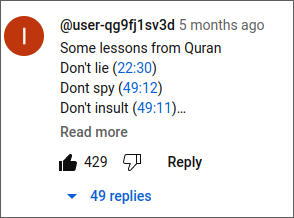
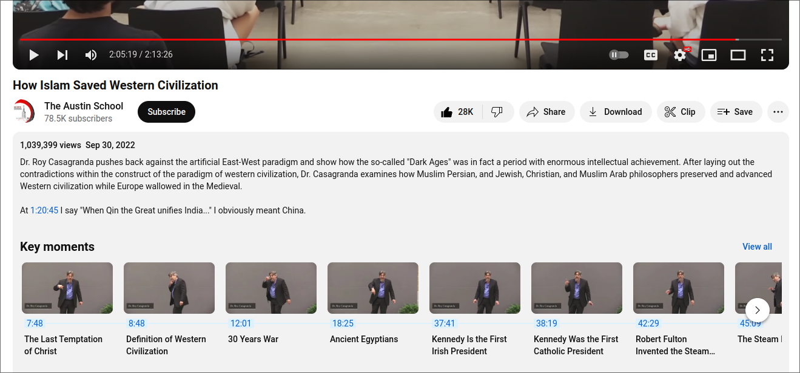

+++
title = 'some natural axioms(?) of living'
date = 2024-01-05T16:43:03Z
+++

-   Don't lie (22:30)
-   Dont spy (49:12)
-   Don't insult (49:11)
-   Don't waste (17:26)
-   Feed the poor (22:36)
-   Don't backbite (49:12)
-   Keep your oaths (5:89)
-   Don't take bribes (27:36)
-   Honour your treaties (9:4)
-   Restrain your anger (3:134)
-   Don't spread gossip (24:15)
-   Think good of others (24:12)
-   Be good to guests (51:24-27)
-   Don't harm believers (33:58)
-   Don't be rude to parents (17:23)
-   Turn away from ill speech (23:3)
-   Don't make fun of others (49:11)
-   Walk in a humble manner (25:63)
-   Respond to evil with good (41:34)
-   Keep your trusts & promises (23:8)
-   Don't insult others' false gods (6:108)
-   Don't ask unnecessary questions (5:101)
-   Don't call others with bad names (49:11)
-   Don't claim yourselves to be pure (53:32)
-   Speak nicely, even to the ignorant (25:63)
-   Don't ask for repayment for favours (76:9)
-   If enemy wants peace, ther accept it (8:61)
-   Return a greeting in a better manner (4:86)
-   Don't remind others of your favours (2:264)
-   Make peace between fighting groups (49:9)
-   Lower your voice and talk moderately (31:19)
-   Don't ask too many favours from people (2:273)
-   Speak gently, even to leaders of disbelief (20:44)
-   Don't criticize small contributions of others (9:79)
-   Try to make peace between husband & wife (4:128)
-   Oppression/corruption is worse than killing (2:217)
-   Preach to others in a good and wise manner (16:125)
-   Don't accuse others of immorality without proof (24:4)
-   Don't call someone disbeliever without knowing (4.94)
-   Know your enemies can become your close friends (41:34)
-   Don't wrongly consume the wealth of the vulnerable (4:29)
-   Forgive others, as you would like Allah to forgive you (24:22)
-   If unable to help a needy person, at least speak nice words (17:28)
-   Verify information from a dubious source before acting upon it (49:6)
-   Those who can should continue to spend on those less fortunate (24:22)
-   Don't sit with those who mock religion until they change the subject (4:140)
-   The worldly life is nothing but an illusionary enjoyment (3:185)

I actually found this in a youtube comment to [this very informative lecture](https://www.youtube.com/watch?v=C8M4i9fvq1M)
I checked the validity of some of the references, but I will update this post insha'Allah when I fully check.

<!--  -->

